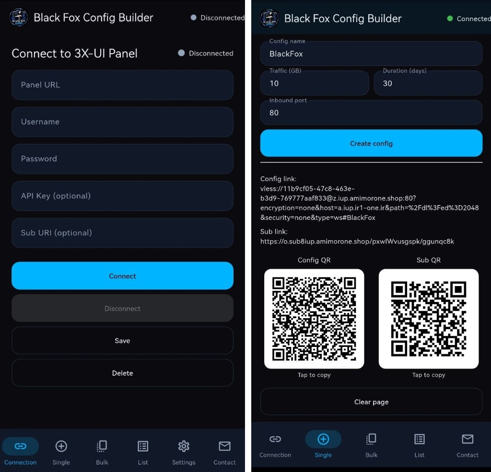
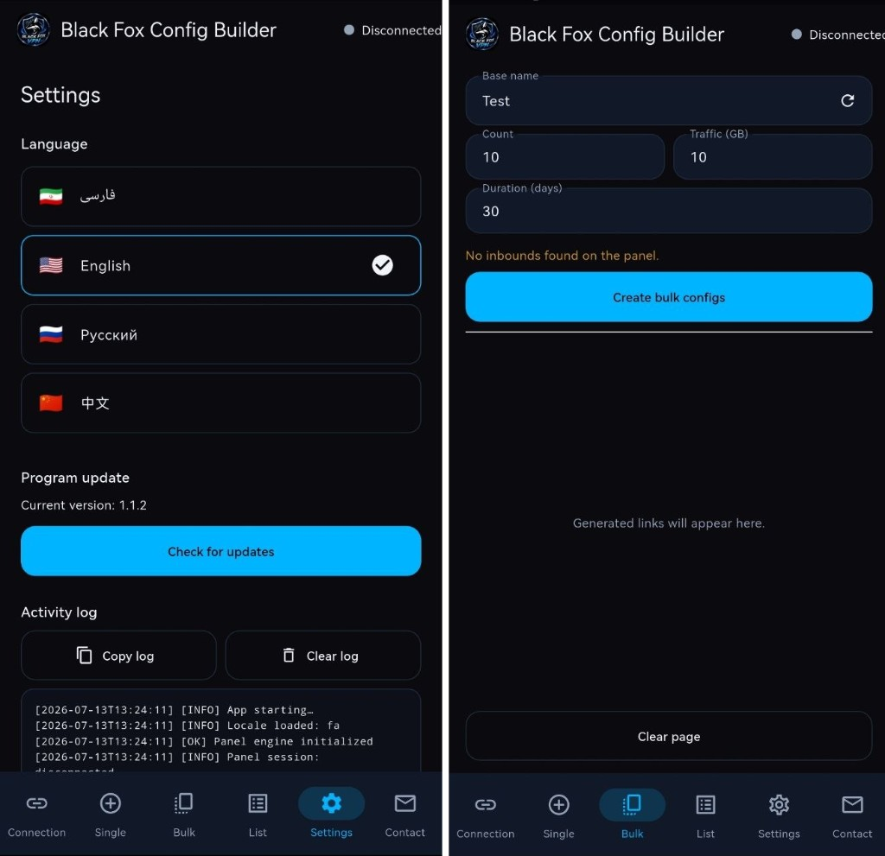

  

<h1 align="center">Black Fox Config Builder</h1>

  <strong>Android app for 3X-UI panel config creation</strong> 
  Single & bulk configs — no browser login required

  <a href="https://foxnext.net">Website</a> •
  <a href="https://foxnext.net/downloads/Black-Fox-Config-Builder.apk">Download APK</a> •
  <a href="https://github.com/balckfoxgroup/blackfox-vpn-installer">Black Fox VPN</a> •
  <a href="https://t.me/blackFoxVPNN">Telegram</a>

---

## What's New

| Platform | App | Status |
|----------|-----|--------|
| Android | **Black Fox Config Builder** | **Available** — v1.1.3 |

---

## English

An app for creating single and bulk configs without logging into the 3X-UI panel in a browser the classic way. Simple and easy to use.

| Resource | Link |
|----------|------|
| Website | [foxnext.net](https://foxnext.net) |
| Download APK | [Black-Fox-Config-Builder.apk](https://foxnext.net/downloads/Black-Fox-Config-Builder.apk) |
| User guide (EN) | [docs/GUIDE.en.md](docs/GUIDE.en.md) |
| User guide (FA) | [docs/GUIDE.fa.md](docs/GUIDE.fa.md) |
| Black Fox VPN (Windows/Android) | [balckfoxgroup/blackfox-vpn-installer](https://github.com/balckfoxgroup/blackfox-vpn-installer) |
| Telegram | [@blackFoxVPNN](https://t.me/blackFoxVPNN) |

**Current version:** 1.1.3 — [Download APK](https://foxnext.net/downloads/Black-Fox-Config-Builder.apk) 

Global language support: Full 10-language support is available across all current app editions and the website (foxnext.net): English, Persian (Farsi), Russian, Chinese, German, Uzbek, Turkish, Indonesian, Ukrainian, and Hindi.
---

## فارسی

برنامه‌ای برای ساخت کانفیگ تکی و گروهی بدون لاگین کردن به پنل 3X-UI در مرورگر به شیوه کلاسیک. کاربری ساده و آسان.

| منبع | لینک |
|------|------|
| وب‌سایت | [foxnext.net](https://foxnext.net) |
| دانلود APK | [Black-Fox-Config-Builder.apk](https://foxnext.net/downloads/Black-Fox-Config-Builder.apk) |
| راهنمای کاربر (انگلیسی) | [docs/GUIDE.en.md](docs/GUIDE.en.md) |
| راهنمای کاربر (فارسی) | [docs/GUIDE.fa.md](docs/GUIDE.fa.md) |
| Black Fox VPN (ویندوز/اندروید) | [balckfoxgroup/blackfox-vpn-installer](https://github.com/balckfoxgroup/blackfox-vpn-installer) |
| تلگرام | [@blackFoxVPNN](https://t.me/blackFoxVPNN) |

**نسخه فعلی:** 1.1.3 — [دانلود APK](https://foxnext.net/downloads/Black-Fox-Config-Builder.apk)

---

## Screenshots

<strong>English screens</strong>

  
  

<em>Panel connection & single config · Bulk config & settings</em>

<strong>Persian screens</strong>

  
  

<em>انتخاب زبان و کانفیگ تکی · ساخت گروهی و تنظیمات</em>

---

## Support

- Telegram: [https://t.me/blackFoxVPNN](https://t.me/blackFoxVPNN)
- Website: [https://foxnext.net](https://foxnext.net)
- Email: support@foxnext.net

© Black Fox Security Team
