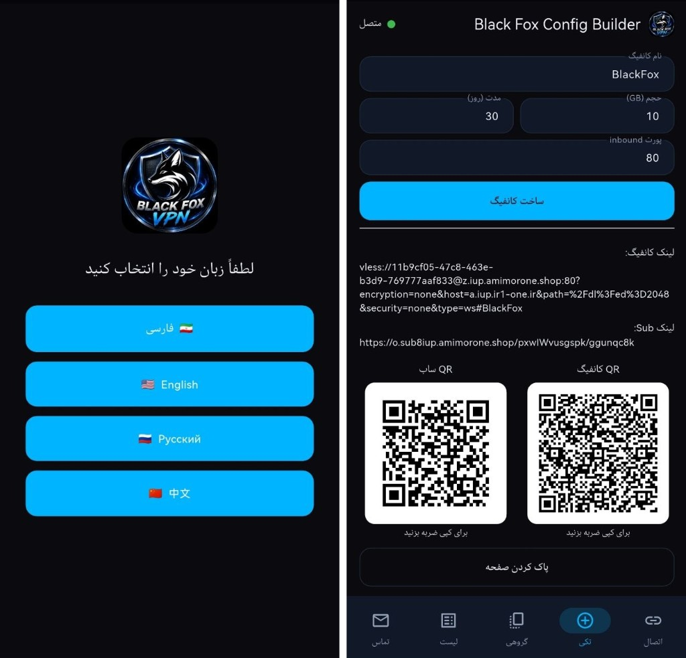
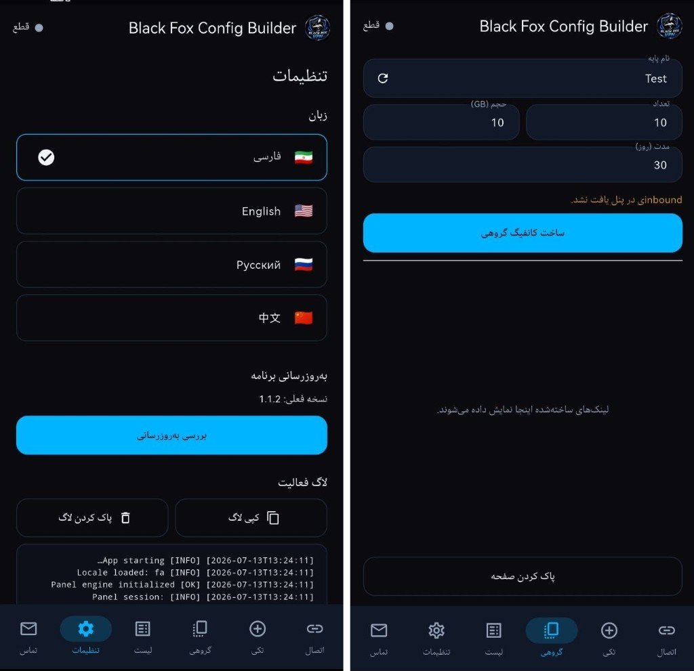

# Black Fox Config Builder — راهنمای کاربر (فارسی)

برنامه **Black Fox Config Builder** برای دسترسی آسان‌تر به پنل مدیریت VPN (3x-ui) و ساخت کانفیگ طراحی شده است.

با استفاده از این برنامه، کاربران هنگام مدیریت پنل با گوشی هوشمند دیگر نیازی به ورود از طریق مرورگر و انجام مراحل ساخت کانفیگ به‌صورت دستی ندارند و می‌توانند به‌راحتی کانفیگ‌های موردنظر خود را ایجاد کنند.

## بخش اول: اتصال به پنل (Connection)

برای استفاده از برنامه، ابتدا باید به پنل 3x-ui متصل شوید.

اطلاعات موردنیاز را از قسمت **Panel Login Info** در برنامه Black Fox VPN Installer دریافت کرده و در کادرهای زیر وارد کنید:

- **Panel URL:** آدرس پنل
- **Username:** نام کاربری پنل
- **Password:** رمز عبور پنل
- **API Key (اختیاری):** در صورت وارد کردن، سرعت برقراری ارتباط و ساخت کانفیگ کمی افزایش پیدا می‌کند.
- **Sub URI (اختیاری):** وارد کردن این قسمت الزامی نیست.

پس از تکمیل اطلاعات، روی **اتصال** کلیک کنید.

اگر اتصال با موفقیت برقرار شود، نشانگر وضعیت در بالای صفحه به رنگ سبز تغییر کرده و عبارت **متصل** نمایش داده می‌شود.

**سایر گزینه‌ها**

- **ذخیره:** ذخیره اطلاعات ورود برای استفاده‌های بعدی.
- **حذف:** پاک کردن اطلاعات ذخیره‌شده.
- **قطع اتصال:** پایان ارتباط با پنل.

## بخش دوم: ساخت کانفیگ تکی

برای ساخت یک کانفیگ جدید، وارد بخش **تکی** شوید.

اطلاعات زیر را تکمیل کنید:

- **نام کانفیگ:** نام دلخواه کانفیگ را وارد کنید.
- **حجم (GB):** حجم مجاز مصرف را بر حسب گیگابایت مشخص کنید.
- **مدت (روز):** مدت اعتبار کانفیگ را بر حسب روز وارد کنید.
- **Inbound:** از لیست Inbound، پورتی را انتخاب کنید که می‌خواهید این کانفیگ از طریق آن به اینترنت متصل شود.

پس از تکمیل اطلاعات، روی **ساخت کانفیگ** کلیک کنید.

بعد از ساخت موفق کانفیگ، اطلاعات زیر نمایش داده می‌شود:

- لینک کانفیگ (VLESS)
- لینک Subscription
- QR Code کانفیگ
- QR Code لینک Subscription

کاربر می‌تواند لینک را کپی کرده یا با اسکن QR Code از آن استفاده کند.

در پایان نیز با استفاده از گزینه **پاک کردن صفحه** می‌توانید اطلاعات نمایش داده‌شده را حذف کنید.

## بخش سوم: ساخت کانفیگ گروهی (Bulk)

اگر قصد دارید چندین کانفیگ با تنظیمات یکسان ایجاد کنید، وارد بخش **گروهی** شوید.

اطلاعات زیر را وارد کنید:

- **نام پایه:** پیشوند نام کانفیگ‌ها
- **حجم (GB):** حجم هر کانفیگ
- **مدت (روز):** مدت اعتبار هر کانفیگ
- **تعداد:** تعداد کانفیگ‌هایی که باید ساخته شوند

پس از وارد کردن اطلاعات، روی **ساخت کانفیگ گروهی** کلیک کنید.

تمامی لینک‌های ساخته‌شده در قسمت پایین صفحه نمایش داده می‌شوند و می‌توانید آن‌ها را کپی یا برای کاربران ارسال کنید.

## بخش چهارم: لیست کانفیگ‌ها (List)

در این بخش، لیست تمامی کانفیگ‌هایی که توسط برنامه Black Fox Config Builder ساخته‌اید نمایش داده می‌شود.

از طریق منوی سه‌نقطه کنار هر کانفیگ می‌توانید به گزینه‌های مدیریتی مانند ویرایش دسترسی داشته باشید.

## بخش پنجم: تنظیمات (Settings)

در بخش تنظیمات امکانات زیر در دسترس است:

1. **تغییر زبان برنامه** — از این قسمت می‌توانید زبان برنامه را تغییر دهید.
2. **بروزرسانی برنامه** — برنامه به‌صورت خودکار و با اجازه کاربر بررسی و بروزرسانی می‌شود. همچنین یک گزینه دستی برای بروزرسانی در نظر گرفته شده است.
3. **Log** — در این قسمت گزارش عملیات انجام‌شده در برنامه نمایش داده می‌شود.

